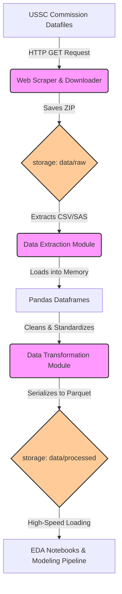

# Phase 1 Architecture: Data Ingestion & Transformation

## Overview
Phase 1 of the real-time federal sentencing disparity system focused on establishing a robust, automated data infrastructure. The primary goal was to securely acquire raw sentencing data from the United States Sentencing Commission (USSC), handle complex legacy formats, and transform the data into a high-performance, columnar storage format suitable for machine learning and real-time inference.

## System Architecture

## Component Details

### 1. Data Ingestion Pipeline ([src/data/download_ussc.py](file:///Users/adinarayananuthalapati/Documents/niw/antigravity-niw/src/data/download_ussc.py))
- **Purpose**: Automates the discovery and downloading of public USSC Individual Offender Datafiles.
- **Workflow**:
  1.  **Web Scraping**: Uses `requests` and `BeautifulSoup4` to parse the USSC Commission Datafiles page HTML.
  2.  **Link Resolution**: Dynamically finds all hrefs pointing to `.zip` files, resolving relative URLs using `urllib.parse.urljoin`.
  3.  **Target Selection**: Specifically searches for recent Fiscal Year datasets in CSV format (e.g., `opafy24nid_csv.zip`). If the site structure changes unexpectedly, a hardcoded fallback to a known stable USSC endpoint is utilized.
  4.  **Streaming Download**: Downloads the multi-gigabyte ZIP archives using a chunked streaming approach (`response.iter_content`). This prevents exhausting system memory during ingestion. A `tqdm` progress bar provides real-time CLI feedback.
- **Storage**: Raw ZIP files are saved immutably to the `data/raw/` directory.

### 2. Data Transformation Engine (`src/data/convert_to_parquet.py`)
- **Purpose**: Extracts raw tabular data (CSV/SAS) and converts it into Apache Parquet format.
- **Why Parquet?**: The USSC CSV datasets often exceed 50,000+ rows and hundreds of columns. Parquet is a columnar storage format that compresses the data up to 80% more than CSV and allows analytical queries (like filtering by `DISTRICT`) to execute exponentially faster.
- **Workflow**:
  1.  **Extraction**: Automatically scans the `data/raw/` directory, extracts any ZIP archives, and recursively searches for nested `.csv`, `.txt`, or `.sas7bdat` files.
  2.  **Memory-Efficient Loading**: Utilizes Pandas to load the raw data. CSVs are read using `low_memory=False` and `encoding='latin1'` to aggressively handle the chaotic encoding and mixed data types often found in legacy government files. Note: Support for legacy SAS datasets (`.sas7bdat`) is also built-in via the `pyreadstat` dependency.
  3.  **Standardization**: Column names are stripped of whitespace and uniformly converted to uppercase to prevent schema mismatches in future years.
  4.  **Serialization**: The dataframe is serialized to disk using the `pyarrow` engine.
- **Storage**: Processed Parquet files are saved to the `data/processed/` directory.

### 3. Exploratory Environment (`notebooks/01_EDA.ipynb`)
- **Purpose**: Provides a sandbox for initial statistical analysis and validation of the Parquet generation.
- **Capabilities**: Connects directly to `data/processed/opafy24nid.parquet`, validating shapes, checking for null values in key metrics like `SENTTOT` (Total Sentence Length), and visualizing distributions before they are fed into the modeling pipeline.

## Scalability and Future Enhancements
While this local architecture is sufficient for Phase 1 proof-of-concept modeling, the following enhancements are planned for nationwide rollout (Phase 3+):
1.  **Orchestration**: Transitioning these individual Python scripts into an **Apache Airflow** DAG for scheduled execution (e.g., monthly cron jobs pulling new USSC updates).
2.  **Cloud Storage**: Moving `data/raw` and `data/processed` to **Amazon S3**, replacing local file paths with `s3a://` URIs.
3.  **Compute**: Replacing Pandas with **Apache Spark (PySpark)** to horizontally scale the Parquet conversion if integrating historical data spanning back to 2005 (millions of records).
